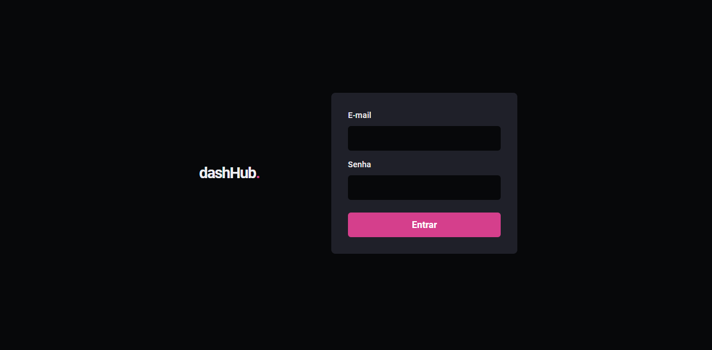
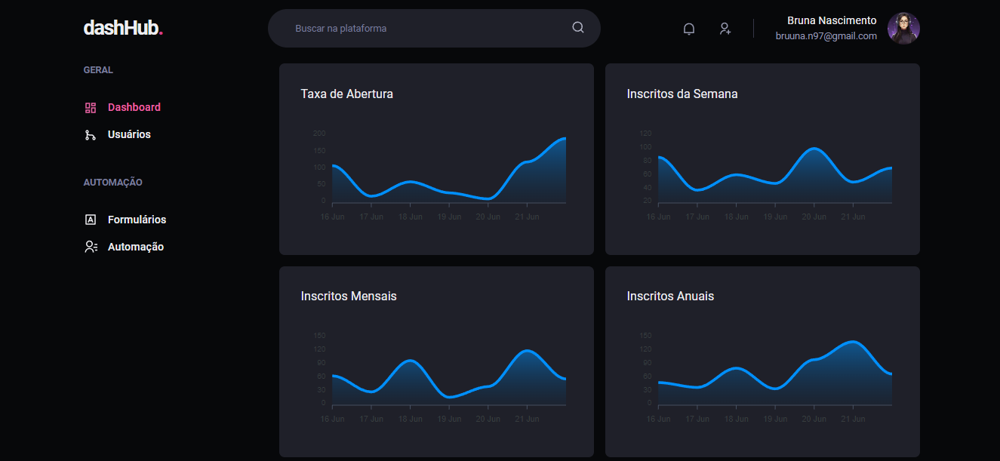
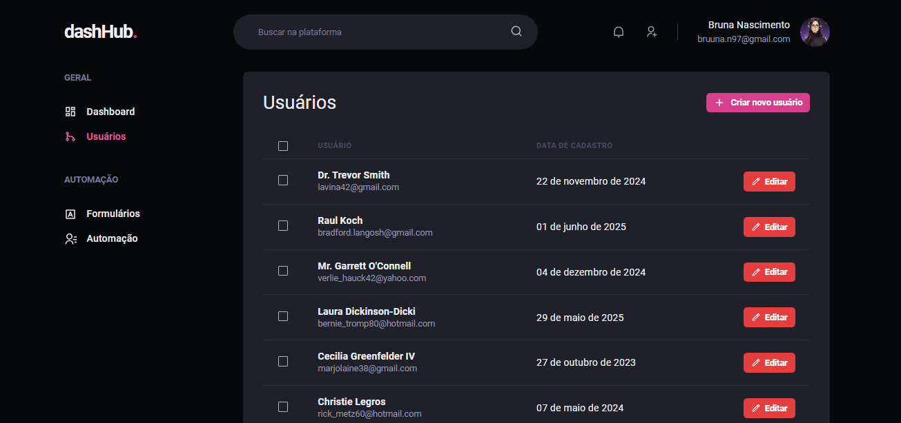
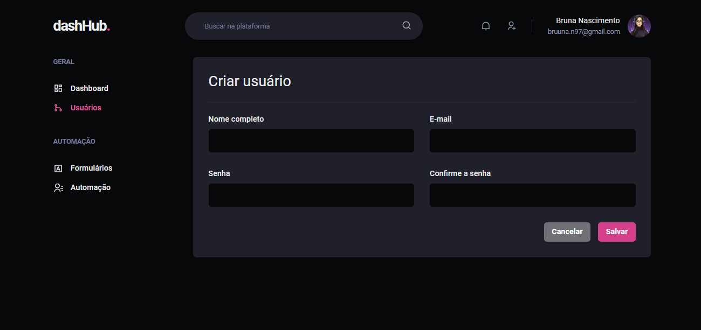

<h1 align="center">
    dashHub.
</h1>

  <a href="#-projeto">Projeto</a>&nbsp;&nbsp;&nbsp;|&nbsp;&nbsp;&nbsp;
  <a href="#-tecnologias">Tecnologias</a>&nbsp;&nbsp;&nbsp;|&nbsp;&nbsp;&nbsp;
  <a href="#memo-licença">Licença</a>

  

## 💻 Projeto

dashHub é um dashboard moderno com um design focado em uma interface limpa e intuitiva. Ele permite a visualização e gerenciamento de informações essenciais para os usuários. O projeto faz uso de gráficos interativos para exibir dados como taxas de abertura, inscritos semanais, mensais e anuais, utilizando a biblioteca Apex Charts. Além disso, o layout é responsivo, com uma navegação clara e organizada, incluindo funcionalidades de automação e gerenciamento de formulários.

 

  

  

  

  

## 🚀 Tecnologias

Esse projeto foi desenvolvido com as seguintes tecnologias:

- NextJS
- TypeScript
- React-Query
- Chakra UI
- Apex Charts
- MirageJS
- Git e Github

## :memo: Licença

Esse projeto está sob a licença MIT.
